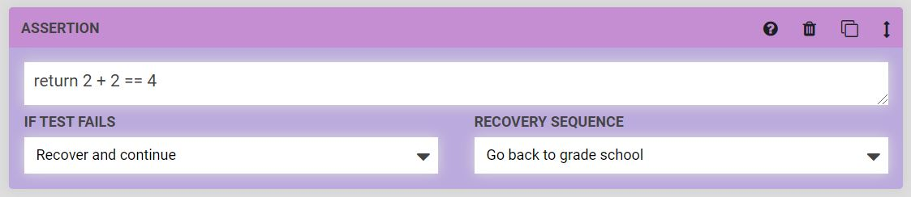

The **Assertion** command allows FarmBot to test if a condition is true or false for automated testing purposes. For example, you could set up a FarmBot to move back and forth repeatedly along an axis, and check the position after each movement. This type of test is useful for high-cycle hardware testing, and for continuous integration testing of software changes.



Assertions must be written in **Lua**, and will be evaluated against a Lua 5.2 interpreter. In the event that a **TEST FAILS**, FarmBot can either `Continue` execution, `Recover and continue`, `Abort and recover`, or just `Abort` execution altogether. The **RECOVERY SEQUENCE** allows you to reset FarmBot to a known state after a failure, send a message, or perform any other desired operations.

# Available functions
The following functions are available for usage along with [Lua's standard library](https://www.lua.org/manual/5.2/). Note that comments are ignored by the interpreter, and there are also options to control FarmBot with Lua.

## get_position()


```lua
-- Returns a table containing the current position data

position = get_position();
if position.x <= 20.55 then
  return true;
else
  print("current position: (", position.x, ",", position.y, "," position.z, ")");
  return false;
end

return get_position("y") <= 20;
```

## get_pins()


```lua
-- Returns a table containing current pin data

pins = get_pins();
if pins[9] == 1.0 then
  return true;
end

return get_pin(10) == 0;
```

## send_message()


```lua
-- send_message(type, message, channels)
-- Sends a message to farmbot's logger

send_message("info", "hello, world", ["toast"]);
```

## calibrate(axis)


```lua
-- Calibrate an axis

calibrate("x");
calibrate("y");
calibrate("z");
```

## Emergency lock and unlock


```lua
-- Lock and unlock farmbot's firmware

emergency_lock();
emergency_unlock();
```

## find_home(axis)


```lua
-- Find home on an axis

find_home("x");
find_home("y");
find_home("z");
```

## home(axis)


```lua
-- Go to home on an axis

home("x");
home("y");
home("z");
```

## coordinate(x, y, z)


```lua
-- Create a vec3

move_to = coordinate(1.0, 0, 0);
```

## move_absolute(x, y, z)


```lua
-- Move in a line to a position

move_absolute(1.0, 0, 0);
move_absolute(coordinate(1.0, 20, 30));
```

## check_position(vec3, tolerance)


```lua
-- Check a position against Farmbot's current position within an error threshold

move_absolute(1.0, 0, 0);
return check_position({x = 1.0, y = 0; z = 0}, 0.50);

move_absolute(20, 100, 100);
return check_position(coordinate(20, 100, 100), 1);
```

## read_status(arg0)


```lua
-- Get a field on farmbot's current state

status = read_status();
return status.informational_settings.wifi_level >= 5;

return read_status("location_data", "raw_encoders") >= 1900;
```

## version()


```lua
-- Return Farmbot's current version

return version() == "8.1.2";
```

## get_device(field)


```lua
-- Return the device settings

return get_device().timezone == "America/los_angeles";

return get_device("name") == "Test Farmbot";
```

## update_device(table)


```lua
-- Update device settings

update_device({name = "Test Farmbot"});
```

## get_fbos_config(field)


```lua
-- Return the current fbos_config

return get_fbos_config("auto_sync");
return get_fbos_config().os_auto_update;
```

## update_fbos_config(table)


```lua
-- Update the current fbos_config

update_fbos_config({auto_sync = true, os_auto_update = false});
```

## get_firmware_config(field)


```lua
-- Return current firmware_config data

return get_firmware_config().encoder_enabled_x == 1.0;

return get_firmware_config("encoder_enabled_z");
```

## update_firmware_config(table)


```lua
-- Update current firmware_config data

update_firmware_config({encoder_enabled_z = 1.0});
```

