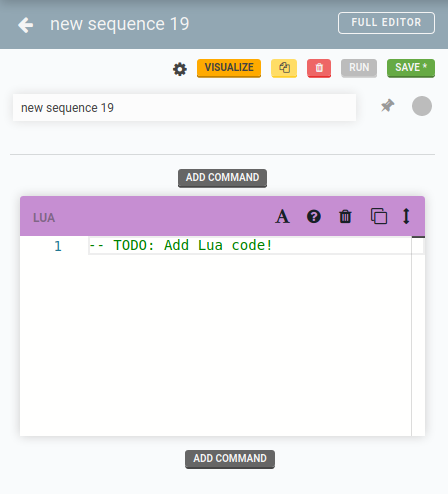

* toc
{:toc}

# Sending Slack™ Chat Messages with FarmBot


It is possible for FarmBot to send outbound HTTP requests using [Lua scripting](../lua.md). This feature can be used to create third-party integrations with proprietary software products that offer web hook integrations, such as [Slack](https://slack.com/).

In the tutorial below, we will demonstrate how it is possible to send messages from FarmBot to Slack.

## How It Works

 1. FarmBot performs an HTTP POST to an [incoming Webhook URL](https://en.wikipedia.org/wiki/Webhook) on Slack's servers.
 2. Slack transforms the HTTP request to a message that is seen by Slack users in a particular chat room.

## Step I: Generate an Incoming Webhook URL

Before you begin, you will need to generate an incoming Webhook URL. Since these instructions may change over time, we recommend referencing the [official Slack Webhook documentation](https://api.slack.com/messaging/webhooks) for guidance.

By the end of setup, you will have a URL that can be used to generate messages on Slack by way of a HTTP POST.

**DO NOT SHARE THIS URL.** Anyone with access to the URL will be able to send messages to your Slack channel.

## Step II: Create a Sequence

Once you have a Slack Webhook URL, you can create a sequence with a Lua block. Visit the [sequence editor](https://software.farm.bot/docs/sequences) and create a new sequence that contains an empty [Lua block](../lua.md):



## Step II: Add Lua Code

Paste the following code below, **replacing the example with a real Webhook URL generated in step I**.

```lua
payload = json.encode({
  text = "FarmBot says hi! :wave:"
})

url = "https://hooks.slack.com/services/CHANGE/THIS/URL"

res, err = http({ url = url, method = 'POST', headers = {}, body = payload })

if err then
    send_message("error", "ERROR: " .. inspect(err), {"toast"})
else
    send_message("debug", "REQUEST SENT: " .. inspect(res))
end
```

When you finish pasting the code above, you can test it via the RUN button.

## Step III: Run the Sequence in the Real World

Once the sequence is coded and saved, you can run it in a variety of ways:

 * By using the RUN button in the [sequence editor](https://software.farm.bot/docs/sequences).
 * By binding the sequence to a physical button on the device via [pin binding](https://software.farm.bot/docs/pin-bindings).
 * On a recurring timer, via [Farm Events](https://software.farm.bot/docs/events)
 * Via third party software, using [FarmBot.JS](https://github.com/FarmBot/farmbot-js)
