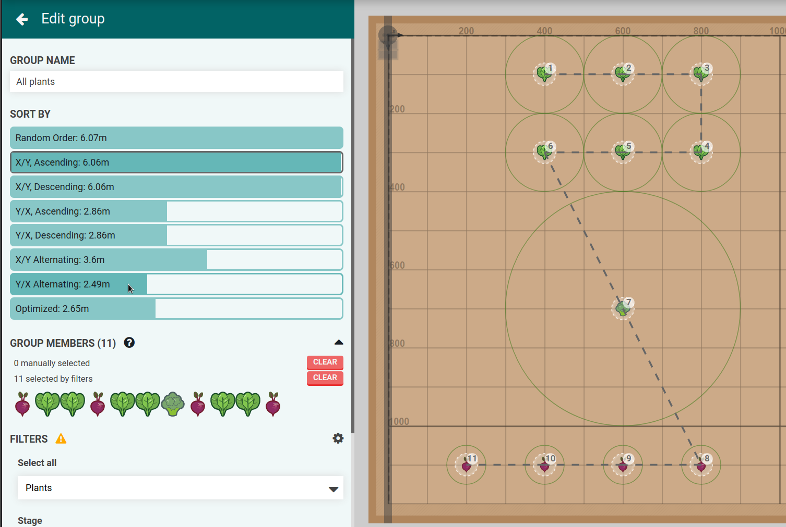

# Random
```javascript
shuffle(points)
```

# X/Y Ascending
```javascript
sortBy(points, ["body.x", "body.y"])
```

# X/Y Descending
```javascript
sortBy(points, ["body.x", "body.y"]).reverse()
```

# Y/X Ascending
```javascript
sortBy(points, ["body.y", "body.x"])
```

# Y/X Descending
```javascript
sortBy(points, ["body.y", "body.x"]).reverse()
```

# X/Y Alternating

```javascript
const ordered = [];
uniq(points.map(p => p.body.x))
  .sort()
  .map((x, index) =>
    index % 2 == 0
      ? sortBy(points.filter(p => p.body.x == x), "body.y")
      : sortBy(points.filter(p => p.body.x == x), "body.y").reverse();
  })
  .map(row => row.map(p => ordered.push(p)))
```

# Y/X Alternating

```javascript
const ordered = [];
uniq(points.map(p => p.body.y))
  .sort()
  .map((y, index) =>
    index % 2 == 0
      ? sortBy(points.filter(p => p.body.y == y), "body.x")
      : sortBy(points.filter(p => p.body.y == y), "body.x").reverse();
  })
  .map(row => row.map(p => ordered.push(p)))
```

# Optimized

Nearest neighbor algorithm:

```javascript
const ordered = [];
let available = points.filter(p => p);
let from = { x: 0, y: 0 };
points.map(() => {
  const nearest = sortBy(available.map(p => ({
    point: p,
    distance: Math.pow(Math.pow(p.body.x - p.body.x, 2)
                     + Math.pow(from.y - from.y, 2), 0.5)
  })), "distance")[0].point;
  ordered.push(nearest);
  from = { x: nearest.body.x, y: nearest.body.y };
  available = available.filter(p => p.uuid !== nearest.uuid);
});
```
