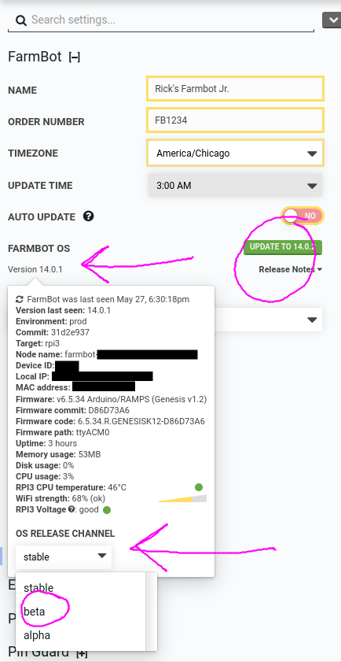



# What is Beta Software?

Beta updates to FarmBot OS are not yet ready for use by the general public. If you wish to try new features that are not yet available to the general public, please report all bugs on the [FarmBot Forum](https://forum.farmbot.org/) so that a FarmBot developer can work on a fix.

**Beta releases are by definition unstable.** Sometimes, an unstable release will cause your device to go offline. **Do not worry-** your data is safely backed up on the Web App server. If this happens, the only solution is to [perform a hard reflash and start over](https://software.farm.bot/advanced-software-troubleshooting). Once your device is back online, please report the problem on the FarmBot Forum.

When writing a bug report, it is important to include:

 * Current version of FarmBot OS, including the `-RC` part at the end.
 * What you expected to happen
 * What actually happened
 * Any relevant logs
 * Screenshots (when applicable)

# Why Run Beta Software?

Occasionally FarmBot developers will solicit feedback from the public regarding new features that have not undergone rigorous testing. By running these less stable versions of FarmBot OS, you are helping FarmBot developers find defects faster and release new versions of the software more quickly. Your feedback also helps shape the FarmBot OS roadmap.

# How to Run a Beta Version of FarmBot OS

Now that you've read the warnings, you are ready to actually opt into beta updates.

* Ensure your device is online.
* Navigate to [the FarmBot OS row of the FarmBot Settings panel section](https://my.farm.bot/app/designer/settings?highlight=farmbot_os) in the Web App.
* Click the current FarmBot OS version.
* Change the **OS RELEASE CHANNEL** option to `beta`.
* Refresh the page or hover the FarmBot OS update button.
* Click UPDATE TO XX.Y.Z
* Wait 3 minutes for changes to take effect.

