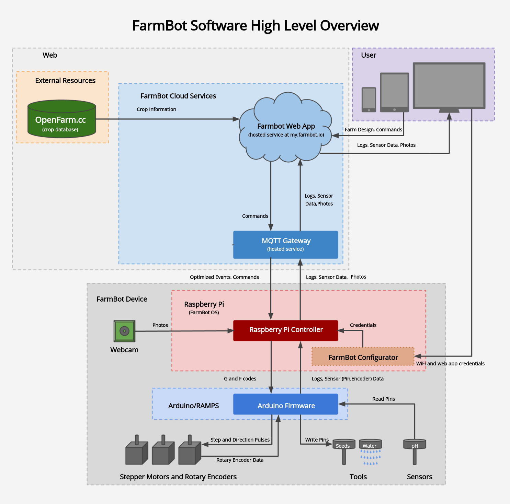
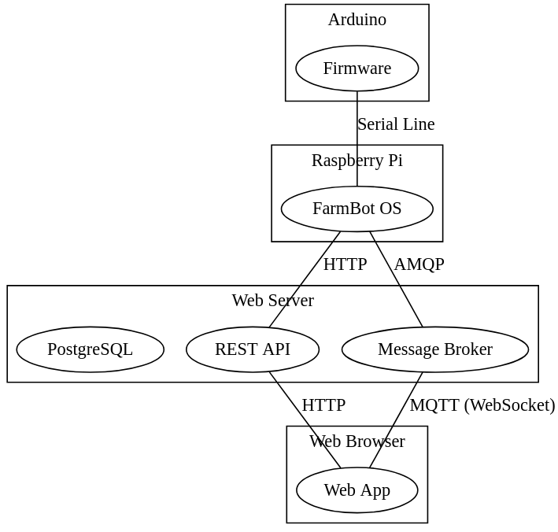

The table below shows a rough overview of the codebases of the FarmBot software system and their development languages. Realistically, no one would need to know all of these languages; the actual tool set required will vary based on the task you want to perform.

|                              |                              |
|------------------------------|------------------------------|
|[Firmware](../firmware.md)      |C++
|[FarmBot OS](../farmbot-os.md)  |Elixir
|[Rest API](../web-app/rest-api.md)      |Ruby on Rails
|[Web App](../web-app.md)        |ReactJS, Typescript, and WebPack

# Hardware and physical peripherals

Farmbot interacts with its environment using physical sensors and actuators. This requires a bridge between the physical garden and the software layer.

The [firmware](../firmware.md) is the software responsible for interaction with the real world. An Arduino based microcontroller runs the firmware and executes sensor and actuator commands. An example of this is seen when a FarmBot turns on the water valve or probes for soil moisture. It is the device firmware that directly tells these peripherals when and how to operate. Other parts of the system may request access to peripherals by sending commands to the firmware.

The [firmware](../firmware.md) package has a limited feature scope by design. It is a highly specialized software component. **It was not designed for developer extensibility.** Farmbot's microcontroller offers exceptional peripheral handling, but suffers from performance drawbacks. It is also a poor host for any task requiring more than a few kilobytes of memory.

For these reasons, **third party customization is best handled within [FarmBot OS](../farmbot-os.md) or the [Web App](../web-app.md)** (discussed below).

# Day to day operations and garden management

An Arduino lacks memory and processing power for non-hardware tasks. To combat these limitations, Farmbot also contains a [Raspberry Pi single board computer](https://www.raspberrypi.org). The Raspberry Pi provides increased memory, CPU and network peripherals. [FarmBot OS](../farmbot-os.md) is an embedded operating system which runs on the Raspberry Pi to manage tasks such as:

 * Communicating messages, such as reports or sensor data, to end users and the [REST API](../web-app/rest-api.md).
 * Enforcing device-level security features.
 * Maintaining and executing a work schedule.
 * Accept incoming remote procedure calls from users and off-device software packages.

FarmBot OS is particularly useful for operations that:

 * Need constant execution, even under network loss.
 * Have low or no network latency tolerance.

# Data storage and the cloud

The Raspberry Pi provides adequate processing power for many tasks. Much like the Arduino, it too suffers some design tradeoffs. The most notable issue is data integrity and availability. Data on the device is not accessible when offline. The device may also experience unexpected power loss and surges that can corrupt the onboard SD card. Additionally, some events, such as email alerts, must occur even when the device is offline.

It is for these reasons that a FarmBot cannot operate 100% autonomously. To mitigate data integrity and availability issues, the device works in concert with an always-on web server, often referred to as "The Web App".

The Web App contains three core components in  one package:

 * A realtime message broker for messaging between the database, user, and device
 * A graphical user interface for end-user device control
 * A REST API for data storage and access

The table below lists common FarmBot use cases and their appropriate software package.

# Common component use cases

|Task                          |Usually handled by...         |
|------------------------------|------------------------------|
|Long-Term Data Storage        |[REST API](../web-app/rest-api.md)
|Remotely managing device when device is offline|[Web App](../web-app.md) and [REST API](../web-app/rest-api.md)
|Managing device and account data.|[Web App](../web-app.md) and [REST API](../web-app/rest-api.md)
|Powering actuators            |[Firmware](../firmware.md)
|Recurring tasks               |[FarmBot OS](../farmbot-os.md)
|Long-running operations, such as watering sequences|[FarmBot OS](../farmbot-os.md)

