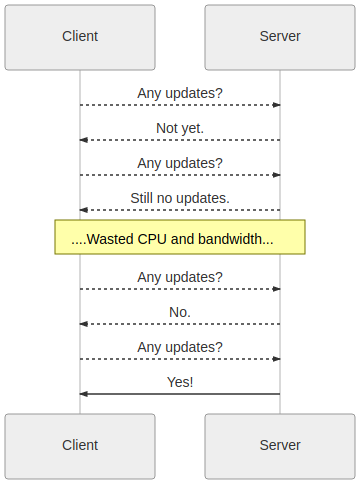

* toc
{:toc}

As we learned in the [previous section](rest-api.md), resources are downloaded from the API as JSON documents.

HTTP is a [stateless protocol](https://en.wikipedia.org/wiki/Stateless_protocol). This offers a number of benefits to application developers but does come with some drawbacks. Most notably, there is a chance that the data you downloaded will go "stale" when people or devices update the resource after you perform the initial resource download.

# Scenario: Sharing Data with Many Users

You work in a 6 person research team that shares a FarmBot. To keep track of the garden, you author a garden viewer application which downloads and displays `Plant` resources via the REST API (`GET https://my.farm.bot/api/plants`).

The application works well, but occasionally, you find that the application is displaying "stale data". That is, the JSON document you downloaded from the API is no longer valid because someone on your team has updated the data after you downloaded it.

How can we make sure we have the latest version of a resource in applications that require consistent data?

# Bad Idea: HTTP Polling

A quick solution is to [perform polling](https://en.wikipedia.org/wiki/Polling_computer_science) (don't do this). That is, we could re-write our application to download `Plant`s on a 30 second timer. Although polling does solve the problem at hand, it comes with a number of drawbacks:

 * Wastes large amounts of bandwidth, which is particularly problematic for metered internet service plans.
 * Computationally expensive, since the application is constantly checking for updates, even when idle.
 * Runs a risk of being rate limited or banned from the server if polling is performed too frequently.



_Inefficient HTTP polling._


# Better Solution: Use Auto-Sync

As we saw in the previous example, polling has a number of drawbacks that make it unsuitable for production scale applications. Luckily, the Web API exposes a feature known as **Auto Sync** which allows you to subscribe to data updates over MQTT. With Auto Sync, there is no need for polling- all data updates are published to subscribers in real-time.

Unlike most other resource management use cases, **Auto Sync is performed via MQTT rather than HTTP.**

To receive data updates for a particular resource, login to the [Message Broker](message-broker.md) and subscribe to an MQTT topic that matches the pattern below:

```
bot/device_DEVICE_ID/sync/RESOURCE_NAME/RESOURCE_ID
```

You will need to replace the CAPITALIZED NAMES above with the following information:

 * `DEVICE_ID` - Integer ID of the current bot
 * `RESOURCE_NAME` - The name of the resource in [CamelCase](https://en.wikipedia.org/wiki/Camel_case). Example: `ToolSlot`, `Sequence`, `FarmEvent`.
 * `RESOURCE_ID` - Integer ID of the resource you wish to receive updates for.



Once you have subscribed to the appropriate channel, you will receive JSON in a format similar to the examples below:

```javascript
// Received via MQTT channel "bot/device_123/sync/User/1"

{
   "args":{
      "label":"123-20ab2-3d2d1"
   },
   "body":{
      "id":1,
      "email":"virgenritchie@reichert.info"
   }
}
```

|Property                      |Usage                         |
|------------------------------|------------------------------|
|`args.label`                  |Unique identifier for the request. **If the change was caused by an HTTP request**, this value will match the `X-Request-Id` of the HTTP request.
|`body`                        |The newly created or updated JSON resource. **A null body indicates that the resource was deleted**.

# Example Auto Sync Subscriptions

The table below illustrates example MQTT topic subscriptions.

|Channel                       |Explanation                   |
|------------------------------|------------------------------|
|`bot/device_123/sync/User/1`  |Subscribes to changes for a single resource: The `User` resource with an id of `1`.
|`bot/device_456/sync/Sequence/#`|Subscribes to any change to any `Sequence` resource.
|`bot/device_789/sync/#`       |Subscribes to _all_ resource updates.

As August 2018, the following resource names are supported: `Crop`, `Device`, `DiagnosticDump`, `FarmEvent`, `FarmwareInstallation`, `FbosConfig`, `FirmwareConfig`, `Image`, `Log`, `Peripheral`, `PinBinding`, `PlantTemplate`, `Point`, `Regimen`, `SavedGarden`, `Sensor`, `SensorReading`, `Sequence`, `Tool`, `User`, `WebAppConfig`, `WebcamFeed`.

# Next Steps

As we've learned in this section, it is possible to subscribe to resource changes via MQTT. **Auto Sync is only for reading data**. If you wish to update resources via MQTT, you may do so via the [Experimental MQTT API](experimental-mqtt-api.md).
