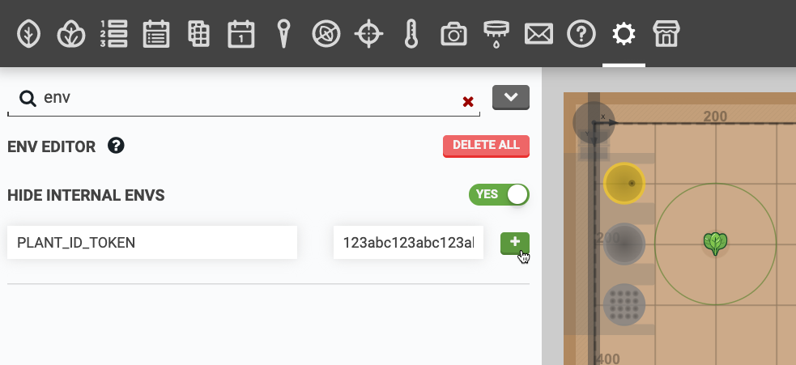
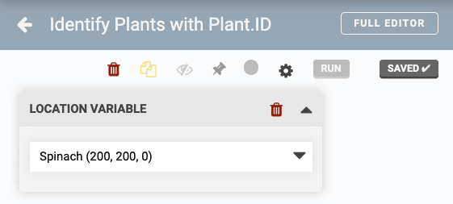
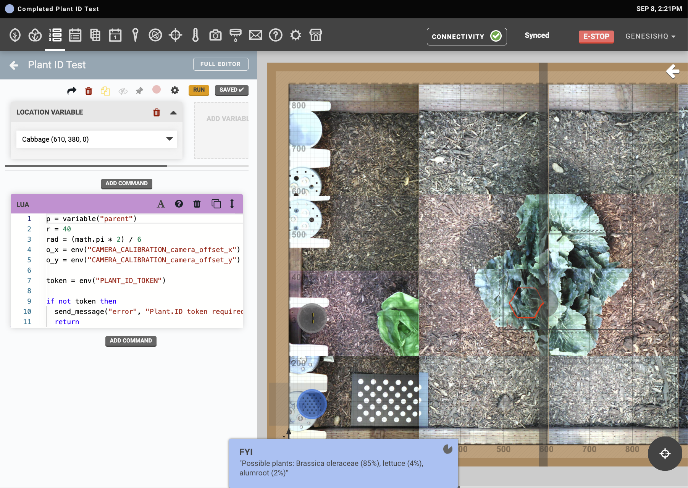

* toc
{:toc}



It is possible for FarmBot to upload images to a 3rd party API for further processing, archiving, machine learning, and more. In this tutorial, we will demonstrate how to upload images from FarmBot to the [Plant.ID](https://plant.id/) API using this abbreviated process:

1. FarmBot takes six photos in a circle around a plant.
2. FarmBot encodes the images in `base64` and performs an HTTP POST to the [Plant.ID API](https://web.plant.id/plant-identification-api/).
3. Plant.ID returns a JSON object including its guesses as to which plant is in the images.
4. FarmBot decodes the JSON and formats a user friendly toast notification and log that are sent to the web app.

# Step 1: Get a Plant.ID token

Before you begin, you will need to [request a Plant.ID API token](https://web.plant.id/api-access-request/).



Once you have a token, you must add it to your FarmBot's ENVs. Navigate to the settings panel and type "env" into the search bar. Enter `PLANT_ID_TOKEN` into the <span class="fb-input">key</span> field and paste your token into the <span class="fb-input">value</span> field. Then click the <span class="fb-button fb-green"><i class="fa fa-plus"></i></span> button.



# Step 2: Create a sequence

Once you have a Plant.ID token, navigate to the [sequence editor](https://software.farm.bot/docs/sequences) and create a new sequence. Add a **location variable** and set it to a plant you would like to identify. Plant.ID supports garden vegetables as well as weeds and native plant species.



# Step 3: Add Lua code

Add a <span class="fb-step fb-lua">Lua</span> command to the sequence and paste in the following code:

```lua
p = variable("parent")
r = 40
rad = (math.pi * 2) / 6
o_x = tonumber(env("CAMERA_CALIBRATION_camera_offset_x") or "0")
o_y = tonumber(env("CAMERA_CALIBRATION_camera_offset_y") or "0")

token = env("PLANT_ID_TOKEN")

if not token then
  send_message("error", "Plant.ID token required", "toast")
  return
end
function s(num)
    x = p.x - o_x + (r * math.cos(rad * num))
    y = p.y - o_y + (r * math.sin(rad * num))
    z = 0
    move_absolute(x, y, z)
    data = take_photo_raw()
    return base64.encode(data)
end

images = {s(1), s(2), s(3), s(4), s(5), s(6)}

headers = {}
headers["Content-Type"] = "application/json"
headers["Api-Key"] = token
body = {
    images = images,
    modifiers = {"health_all", "crops_medium"},
    plant_details = {"common_names"}
}
response, err = http({
    url = "https://api.plant.id/v2/identify",
    method = "POST",
    headers = headers,
    body = json.encode(body)
})

function common_name(num)
  return data["suggestions"][num]["plant_details"]["common_names"][1]
end

function probability(num)
  return math.floor((data["suggestions"][num]["probability"]) * 100 + 0.5)
end

function result(num)
  return common_name(num) .. " (" .. probability(num) .. "%)"
end

if err then
  send_message("error", inspect(err), "toast")
else
  data = json.decode(response.body)
  report = "Possible plants: " .. result(1) .. ", " .. result(2) .. ", " .. result(3)
  send_message("info", inspect(report), "toast")
end
```

Now <span class="fb-button fb-green">SAVE</span> the sequence and wait for it to sync with the FarmBot. You can then test it with the <span class="fb-button fb-orange">RUN</span> button to make sure it functions as expected.



# Step 4: Run the sequence

Once the sequence is coded and saved, you can run it in a variety of ways:

* By using the <span class="fb-button fb-orange">RUN</span> button in the [sequence editor](https://software.farm.bot/docs/sequences).
* By binding the sequence to a physical button on the device via a [pin binding](https://software.farm.bot/docs/pin-bindings).
* From within a parent sequence, via an <span class="fb-step fb-execute">EXECUTE</span> command.
* On a recurring schedule, via an [event](https://software.farm.bot/docs/events).
* Via third party software, using [FarmBot JS](https://github.com/FarmBot/farmbot-js).
