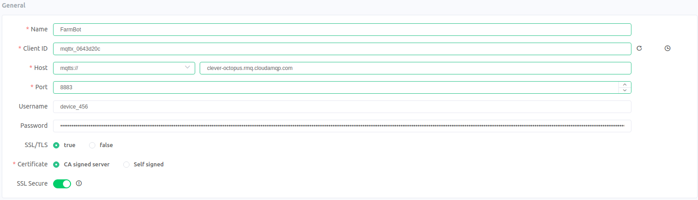

* toc
{:toc}

# Tutorial: Tracking Device Position in Realtime

Some third-party applications require the ability to track FarmBot's XYZ position in realtime. An example of this is seen in the Web App, where the browser quickly redraws the screen to display an animation of device movement.

# Understanding the Problem

# Non-Solutions: Using Lua or the Sequence Editor

Unfortunately, you cannot track the device position in realtime via Lua or the sequence editor:

 * The sequence editor does not have facilities to track position, aside from simple template variables in [SEND MESSAGE](https://software.farm.bot/v14/The-FarmBot-Web-App/sequences/sequence-commands/logic.html#send-message).
 * It is not possible to easily track the position in Lua because the Lua environment does not support concurrent operations. It is possible to read the bot position via [read_status() function](../functions.md#read_statuspath) or [get_position()](../functions.md#get_position), but not in realtime. That is to say, you cannot send commands and read the position at the same time.

**If you want to track the position of FarmBot in real-time, you must write software that runs off-device using MQTT, FarmBot.JS or FarmBot.py.**

# Solution: Track Position with Raw MQTT

FarmBot uses [MQTT](../../Documentation/web-app/message-broker.md#mqtt) to transmit data about its internal state. This data includes position information. It is re-broadcast every time the position changes. The most basic way to read this information is to use an MQTT client like [MQTTx](https://mqttx.app/) or an MQTT library like [Paho MQTT](../../Python/message-broker-examples.md).

In this first example, we will attempt to connect to FarmBot directly using an MQTT client.

Advantages of raw MQTT:

 * Will work in any programming language that supports MQTT

Disadvantages of raw MQTT:

 * More difficult to set up than FarmBot.js or FarmBot.py

### Step 1: Generate a Token via `curl` (or Similar)

The FarmBot MQTT requires authentication to read or write to MQTT topics. Before we can access the device, we must [create an access token](../../Python/web-app-api-examples.md#get-your-farmbot-web-app-token).

Let's create a token now, using the [Curl](https://curl.se/) HTTP library:

```
curl -H "Content-Type: application/json" \
     -X POST \
     -d '{"user":{"email":"test123@test.com","password":"password123"}}' \
     https://my.farm.bot/api/tokens
```

this will generate a token that looks something like the example below.

**Pay special attention to the `mqtt`, `bot` and `encoded` properties- you will need these to log on to the server!**

```javascript
{
  "token": {
    "unencoded": {
      "aud": "unknown",
      "sub": 123,
      "iat": 1639316558,
      "jti": "123456789",
      "iss": "//my.farm.bot:443",
      "exp": 1644500558,
      // IMPORTANT: This is the URL to the MQTT server:
      "mqtt": "clever-octopus.rmq.cloudamqp.com",
      // IMPORTANT: This is your username for logging on to
      //            the MQTT server:
      "bot": "device_456",
      "vhost": "xiconfum",
      "mqtt_ws": "wss://clever-octopus.rmq.cloudamqp.com:443/ws/mqtt"
    },
    // IMPORTANT: This is your password for the MQTT server.
    //            The real version will be much longer.
    "encoded": "02a87204c263427b994d772a52ab2ba9"
  },
  "user": {
    "id": 123,
    "device_id": 456,
    "name": "example",
    "email": "example@example.com",
    "created_at": "2020-06-23T15:31:34.499Z",
    "updated_at": "2021-12-10T21:48:01.446Z",
    "agreed_to_terms_at": "2020-06-23T15:31:34.381Z",
    "inactivity_warning_sent_at": null
  }
}
```

## Step 2: Connect to MQTT

Now that we have an access token, we can connect to the MQTT server.

Using the MQTT client or library of your choice, connect to the server:

 * Server URL is the URL found in the `mqtt` property of your auth token. It is `clever-octopus.rmq.cloudamqp.com` in the example above.
 * The port for non-secure MQTT is 1883. Secure MQTT uses port 8883.
 * Your username is the `bot` property of your auth token. This is `device_456` in the example above.
 * Your password is the `encoded` property from the auth token. This is `02a87204c263427b994d772a52ab2ba9` in the example above.
Note: If you are using a browser-based MQTT client, you must use the `mqtt_ws` property instead of `mqtt`.

A screenshot of the MQTT settings as seen in MQTTx are shown below:



## Step 3: Subscribe to the "Status" Topic

FarmBot will send and receive information through [a variety of MQTT topics](../../Documentation/web-app/message-broker.md#step-3-subscribing-to-topics). The topic we care about for this example is the "status" topic, which broadcasts all information about the device in a large JSON object. The topic name depends on your device ID. If your device id was `device_456`, then you would subscribe to:

```
bot/device_456/status
```

Your MQTT client will now receive a new status object every time the bot's internal state changes.

A few things to keep in mind about device status updates:

 * The status object is encoded as JSON.
 * The device status can change for a variety of reasons. Device movement is just one reason, though there are many other possible reasons to trigger a status broadcast (such as pin value changes).
 * The last status message broadcast is always the most valid.
 * The device never broadcasts the reason for the status update. A well written, event-based application does not need to know the reason for a status update. You can track changes by comparing the last status update to the current one.

## Step 4: Parse Incoming Data

Now that your MQTT client is connected, you will begin to see status objects. They will look something like this:

The most important property for our usecase is the `location_data.position` object:

```javascript
{
  "mcu_params": { /* Redacted for clarity */ },
  "process_info": { /* Redacted for clarity */ },
  "user_env": { /* Redacted for clarity */ },
  "jobs": { /* Redacted for clarity */ },
  "pins": { /* Redacted for clarity */ },
  "configuration": { /* Redacted for clarity */ },
  "informational_settings": { "busy": false },
  // IMPORTANT: The data below shows the bot's XYZ position.
  //            a new object will be sent every time the bot
  //            moves.
  "location_data": {
    "position": {
      "x": 358.0,
      "y": 540.8,
      "z": 0.0
    }
  },
}
```

There are many more useful status properties available, such as `informational_settings.busy`.

# Solution: Track Position with FarmBotJS

Dealing with raw MQTT connections is difficult for users who are not familiar with the protocol. We have written a Javascript and Python wrapper library. **FarmBotJS is the library that powers the FarmBot Web App.** It is extremely stable and mature. FarmBotJS is a great first choice for developers building new projects in 2022 and beyond.

An example written in Javascript is provided below. Please see the [official FarmBotJS documentation](https://github.com/FarmBot/farmbot-js) for more details.

```javascript
const Farmbot = require("farmbot").Farmbot;

const fb = new Farmbot({ token: "---REDACTED---" });

// IMPORTANT: The `status` object has the same shape as in
//            the MQTT version.
//            This function is called every time the device
//            state changes.
fb.on("status", (status) => {
  const pos = status.location_data.position;
  console.log(`FarmBot Position: (${pos.x}, ${pos.y}, ${pos.z})`);
});

// IMPORTANT: FBJS will not connect to the MQTT client automatically.
fb.connect();
```

You should see the following output after running the code above in NodeJS:

```
FarmBot Position: (358, 540.8, 0)
FarmBot Position: (358, 540.8, 0)
FarmBot Position: (358, 540.8, 0)
```

# Solution: Track Position with FarmBotPy

FarmBot, Inc. also provides a Python wrapper library. You can learn more about the Python version in the [official documentation](https://github.com/FarmBot/farmbot-py).

```python
from farmbot import Farmbot, FarmbotToken

raw_token = FarmbotToken.download_token("test@example.com",
                                        "password",
                                        "https://my.farm.bot")

fb = Farmbot(raw_token)

class MyHandler:
    def on_connect(self, bot, mqtt_client):
        pass

    def on_response(self, bot, response):
        pass

    def on_error(self, bot, response):
        pass

    def on_log(self, bot, log):
        pass

    def on_change(self, bot, state):
        print("NEW BOT STATE TREE AVAILABLE:")
        print(state)
        print("Current position: (%.2f, %.2f, %.2f)" % bot.position())

fb.connect(MyHandler())
```
