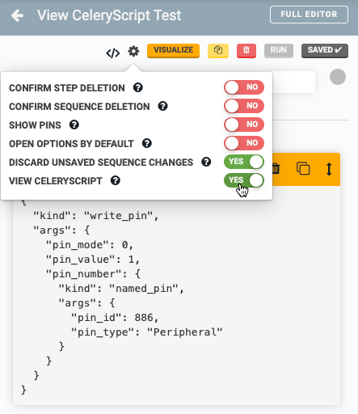
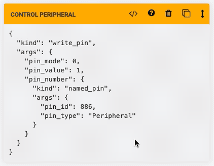
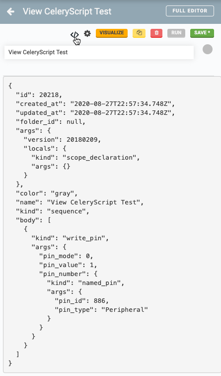

The FarmBot system has [many moving parts](farmbot-software-development/high-level-overview.md). Data must be exchanged between systems in a way that is predictable and asynchronous. Sometimes, this data is even used for telling the bot what to do in a similar fashion to traditional programming languages. To accomplish this, we use a special [remote procedure call](https://en.wikipedia.org/wiki/Remote_procedure_call) and data interchange format called **CeleryScript**.

CeleryScript nodes are specially formatted JSON documents. FarmBot uses these documents for a variety of storage and communication use cases and also as an internal programming language for sequence scripting. It is a programming language, serialization format, and RPC protocol unified under a single schema known as a **corpus**.

With adequate experience, it is possible for a developer to read and write CeleryScript manually, but this is an uncommon occurrence. CeleryScript is typically read and written by automated tools such as servers, FarmBots, compilers, and interpreters. CeleryScript's main goal is uniformity and ease of development when authoring said tools. It has a structure that is optimized for ease of consumption by developer tools which sometimes comes at the expense of human readability. Please keep this design tradeoff in mind as you read the documentation.

# Intended audience

This document is intended for advanced software development and debugging. Many software developers can avoid the low level details of Celery Script by using the [FarmBotJS library](https://github.com/FarmBot/farmbot-js). All of the low-level details of CeleryScript are abstracted away when using a wrapper library.

CeleryScript knowledge is required only if you prefer to not use the wrapper library, are developing new features for the FarmBot platform, or are trying to debug specific problems with the system. It's also a great way for an intrepid software developer to learn FarmBot system internals.

Javascript developers are encouraged to use [FarmBot JS](farmbot-js.md) instead of raw CeleryScript for most use cases.

**If you are writing CeleryScript for a new or unsupported language** you are highly encouraged to write your own wrapper library, as writing CeleryScript by hand is tedious, error-prone and likely to have future compatibility issues. Conversely, migrating and managing auto-generated CeleryScript is often a trivial task that can be accomplished via scripting.

# Where is CeleryScript used?

Celery Script is used:

 * To build an [abstract syntax tree](https://astexplorer.net) of commands in the [sequence editor](https://software.farm.bot/docs/sequences), which get stored and served by the [REST API](web-app/rest-api.md)'s `/sequences` endpoint.
 * To send one-off [movement commands](https://software.farm.bot/docs/controls) and other messages between users and devices over the [message broker](../docs/message-broker.md).
 * Internal functionality such as changing device configuration on-the-fly and triggering firmware updates.

# Examples

To view examples of CeleryScript, open up a sequence in the sequence editor. In the <i class='fa fa-gear'></i> menu, set **VIEW CELERYSCRIPT** to YES. This will show you the CeleryScript of every step in the sequence.

To switch between viewing CeleryScript and the normal UI, press the <i class='fa fa-code'></i> button on any step. Updating fields in the normal UI will update the CeleryScript view.

To view the CeleryScript of the entire sequence, press the <i class='fa fa-code'></i> button in the sequence header.

# What's next?

 * [Nodes](celery-script/nodes.md)
 * [Identifying Success and Failure](celery-script/identifying-success-and-failure.md)
 * [CeleryScript Glossary](celery-script/celeryscript-glossary.md)
