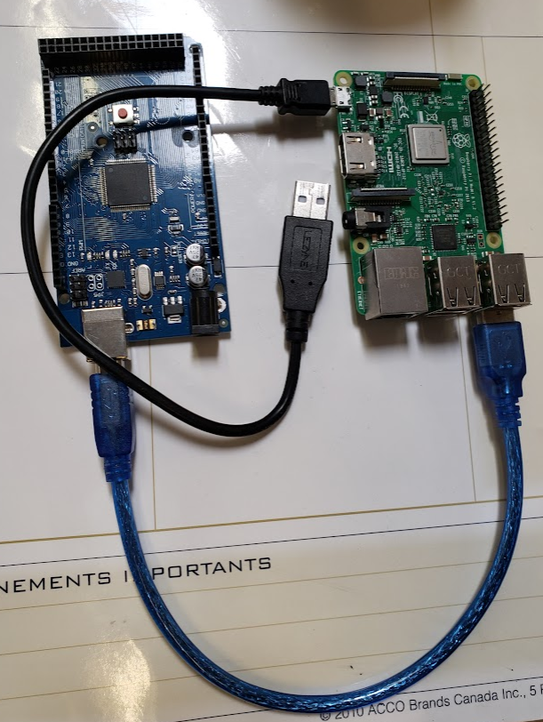

* toc
{:toc}

Some users may wish to simulate a FarmBot without using a real FarmBot. Usually, this is done for the sake of software testing and development. FarmBot currently does not have a simulator, but it is possible to run a FarmBot without any motors attached. This means you can simulate FarmBot operations in software using only a Raspberry Pi, an Arduino, plus a few other supporting components.

FarmBot v1.2 is the easiest model to simulate because it uses off-the-shelf components and has a smaller form factor and lower power requirements than v1.4+ models. Even though v1.2 is not our latest model, it will respond to the same software commands as a v1.6+ device and is fully forward compatible with the Web App.

# Required materials

 * A MicroSD card
 * A MicroSD card reader
 * A Raspberry Pi 3B or 3B+ and relevant USB power cables (~$35). **DO NOT USE DIFFERENT RASPBERRY PI MODELS.** They will not work.
 * An Arduino Mega and relevant USB power cables (~$17).
 * The [latest FarmBot OS image file](http://os.farm.bot)

# Steps

1. Create a new web app account specifically for the "headless" device. **Do not apply power to the Raspberry Pi yet. Do not attempt to re-use accounts that you used with other non-headless devices.**
1. Select "v1.2" for the device hardware in the new web app account.
1. Flash the [latest version of FarmBot OS](https://my.farm.bot/os) to the SD Card.
1. Insert the SD card into the Raspberry Pi and apply power.
1. [Complete WiFi configuration steps](https://software.farm.bot/docs/configurator) and wait for the device to come online.
1. (important) Disable encoders from the device settings page. This will allow for smooth on-screen movement in the Web App when simulating a device.
1. The device is ready for simulation.

