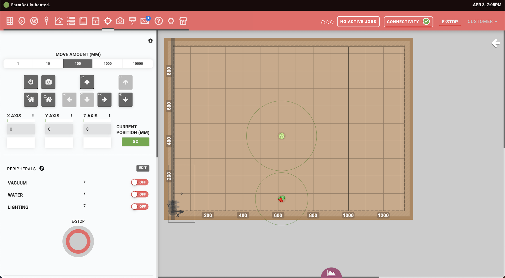
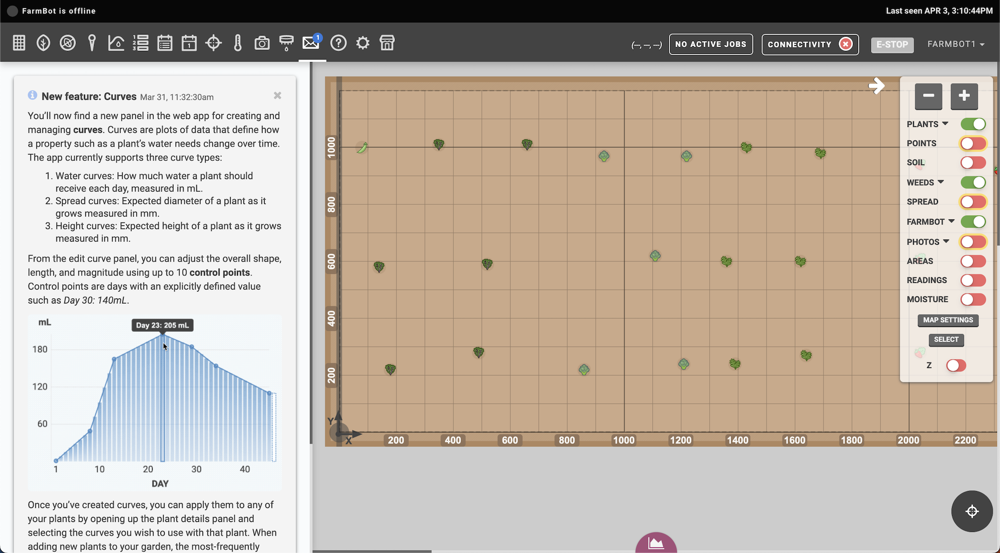

This document outlines a number of tasks and features of the FarmBot Web App that are only available to **server administrators** such as employees of FarmBot Inc or self-hosted users.

# Using the Rails console

Enter the following command to start the Rails console:

```
heroku run rails console --app=farmbot-staging
```

# Creating support tokens

Server admins can create **support tokens** to remotely assist users when requested. From the Rails console, run the following command to send a troubleshooting ticket to the feedback webhook URL. Replace the `id` number with the device id of the user requesting assistance and `name` with your name.

```
Device.find_by(id: 000).provide_feedback("created by staff member name")
```

If your server does not have a feedback webhook URL configured, you can use the following command to generate a support token:

```
puts Device.find($DEVICE_ID).help_customer
```

Paste the token contents into the Javascript console of a browser while using the web app and refresh the page. You will now be logged into the user's account with an admin token, as indicated by the app's main navigation header displaying in red.



Visit `/terminal` for device shell access if needed. Use `Logout and destroy token` when remote assistance has been completed.

# Publishing featured sequences

Administrators can publish **featured sequences** by logging into the web app using the account specified by the `AUTHORIZED_PUBLISHER` environment variable and creating a sequence as usual. Then run the following command:

```
heroku run rake sequence:publish --app=farmbot-staging
```

Enter the sequence ID you wish to publish from the list of available options.

# Posting to the message center

The FarmBot API supports the creation of `Alert` records. When created, the alert will be posted to the **Message Center** of all users who have logged in within the last 7 months. This is useful when creating system-wide announcements such as end-of-life dates, changelog updates, and major new feature announcements.



To post a message, run the following command:

```
heroku run rake broadcast:to_all --app=farmbot-staging
```

Then fill in the following information. Fields that are preceded by `(optional)` may be skipped via the `enter` key. The `type` will determine which icon is shown in the top-left of the message, with options including:

  * <i class='fa fa-info-circle'></i> - `info`
  * <i class='fa fa-check-square'></i> - `success`
  * <i class='fa fa-exclamation-triangle'></i> - `warn`

```
=== (optional) Enter `type`
info
=== (optional) Enter href
http://farm.bot
=== (optional) Enter href label
This is the href label
=== Enter title
This is the alert title
=== Enter content
This is the alert's content.
You can have multiple lines of alert content.
When you are done typing in content, just type three “at symbols” on a new line.
The button below links to the href.
```

When finished entering content, type three `@` symbols on a new line:

```
@@@
```


