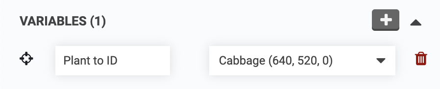

It is possible for FarmBot to upload images to a 3rd party API for further processing, archiving, machine learning, and more. In this tutorial, we will demonstrate how to upload images from FarmBot to the [Plant.ID](https://plant.id/) API using this abbreviated process:

1. FarmBot takes six photos in a circle around a plant.
2. FarmBot encodes the images in `base64` and performs an HTTP POST to the [Plant.ID API](https://web.plant.id/plant-identification-api/).
3. Plant.ID returns a JSON object including its guesses as to which plant is in the images.
4. FarmBot decodes the JSON and formats a user friendly toast notification and log that are sent to the web app.

# Step 1: Add your Plant.ID token



Once you have a token, you must add it to your FarmBot's [custom settings](https://software.farm.bot/docs/custom-settings). Enter `PLANT_ID_TOKEN` into the <span class="fb-input">Setting name (key)</span> field and paste your token into the <span class="fb-input">value</span> field. Then click the <span class="fb-button fb-green"><i class="fa fa-plus"></i></span> button.


# Step 2: Create a sequence

Navigate to the [sequence editor](https://software.farm.bot/docs/sequences) and create a new sequence. Add a **location variable** named "Plant to ID" and set it to a plant you would like to identify.





# Step 3: Add Lua code

Add a <span class="fb-step fb-lua">Lua</span> command to the sequence and paste in the following code:

```lua
plant = variable("Plant to ID")
radius = 40
angle = (math.pi * 2) / 6
offset_x = tonumber(env("CAMERA_CALIBRATION_camera_offset_x") or "0")
offset_y = tonumber(env("CAMERA_CALIBRATION_camera_offset_y") or "0")
token = env("PLANT_ID_TOKEN")
job_name = "Identifying " .. plant.name

-- Check for token
if not token then
  toast("Plant.ID token required", "error")
  return
end

-- Move, then capture and encode image
function capture(num)
    set_job(job_name, {
      percent = (num / 6) * 75,
      status = "Capturing image " .. num
    })
    x = plant.x - offset_x + (radius * math.cos(angle * num))
    y = plant.y - offset_y + (radius * math.sin(angle * num))
    z = 0
    move_absolute(x, y, z)
    data = take_photo_raw()
    return base64.encode(data)
end

-- Capture six images
set_job(job_name)
images = {capture(1), capture(2), capture(3), capture(4), capture(5), capture(6)}

-- Send images to Plant.ID API
set_job(job_name, {
  percent = 90,
  status = "Talking to Plant.ID"
})
headers = {}
headers["Content-Type"] = "application/json"
headers["Api-Key"] = token
body = {
    images = images,
    modifiers = {"health_all", "crops_medium"},
    plant_details = {"common_names"}
}
response, err = http({
    url = "https://api.plant.id/v2/identify",
    method = "POST",
    headers = headers,
    body = json.encode(body)
})

-- Parse common name from Plant.ID response
function common_name(num)
  local suggestions = data["suggestions"][num]
  if suggestions and suggestions["plant_details"] then
    return suggestions["plant_details"]["common_names"][1] or "Unknown"
  end
  return "Unknown"
end

-- Parse probability from Plant.ID response
function probability(num)
  local suggestion = data["suggestions"][num]
  if suggestion then
    return math.floor((suggestion["probability"] or 0) * 100 + 0.5)
  end
  return 0
end

-- Format result
function result(num)
  return common_name(num) .. " (" .. probability(num) .. "%)"
end

-- Display top 3 results
if err then
  toast(inspect(err), "error")
else
  data = json.decode(response.body)
  toast("Possible plants: " .. result(1) .. ", " .. result(2) .. ", " .. result(3))
end

complete_job(job_name)
```

# Step 4: Run the sequence

<span class="fb-button fb-green">SAVE</span> the sequence and wait for it to sync with the FarmBot. You can then test it with the <span class="fb-button fb-orange">RUN</span> button to make sure it functions as expected.

{%
include callout.html
type="info"
content="Note that the Lua code does not upload the images to the FarmBot API (it only uploads them to the Plant.ID API), so you will not see them in the web app or be able to access them later.

If you would like the images to be saved, you can add a `take_photo()` command to the `capture()` function before moving to the next location. This will take a second photo from the same position and upload it to the FarmBot API while the first image is encoded and uploaded to the Plant.ID API."
%}


Once the sequence is verified to be working, you can run it in a variety of ways:

* By using the <span class="fb-button fb-orange">RUN</span> button in the [sequence editor](https://software.farm.bot/docs/sequences).
* By binding the sequence to a physical button on the device via a [pin binding](https://software.farm.bot/docs/pin-bindings).
* From within a parent sequence.
* On a recurring schedule, via an [event](https://software.farm.bot/docs/events).
* Via third party software, using [FarmBotPy](../../python/intro.md) or [FarmBotJS](../../docs/farmbot-js.md).
