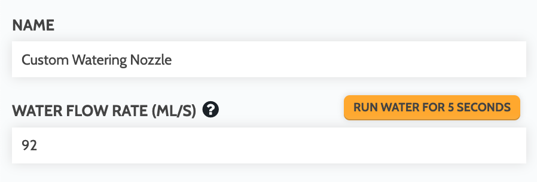

# dismount_tool()

**Dismounts the currently mounted tool** into it's assigned slot, taking into account the slot's direction.



```lua
-- Dismount the currently mounted tool
dismount_tool()

-- It is recommended to find home after dismounting tools
-- to stage FarmBot for future operations
find_home()
```

# dispense(mL, params?)

**Dispenses the given amount of liquid in milliliters**. Defaults to using the "Watering Nozzle" tool, its **WATER FLOW RATE (ML/S)** value, and the solenoid valve operated by pin `8`.

```lua
-- Dispense 100 mL of water using default values
dispense(100)
```

The `params` argument is optional and can be used to override the default `tool_name` (and therefore the **WATER FLOW RATE (ML/S)** value) as well as which `pin` to operate.

```lua
-- Dispense 200 mL of fertilizer using a custom tool operated by pin 7
dispense(200, {tool_name = "Custom Watering Nozzle 2", pin = 7})
```

```lua
-- Dispense 300 mL of water with the standard "Watering Nozzle" tool, but using a solenoid valve operated by pin 10
dispense(300, {pin = 10})
```



# mount_tool(tool)

**Mounts the given tool** and pulls it out of its slot, taking into account the slot's direction.



```lua
-- It is recommended to find home before mounting tools
-- to ensure accuracy of movements
find_home()

-- Add a Location variable named "Tool" to the sequence
-- and select the tool you wish to mount
tool = variable("Tool")

-- Because tools themselves do not have coordinates, FarmBot
-- will look up which slot the chosen tool has been assigned
-- to and use the slot's coordinates in the mount_tool() function
mount_tool(tool)
```

To mount a specific tool without using variables, fetch the tool from the FarmBot API using its ID:

```lua
-- The ID for the tool you wish to mount
tool_id = 1

-- Fetch the tool from the API
tool = api({method = "get", url = "/api/tools/" .. tool_id})

-- Mount the tool
mount_tool(tool)
```

Alternatively, simply specify a tool name:

```lua
-- Mount a tool by name
mount_tool("My Tool")
```

# verify_tool()

**Verifies if a tool is mounted to the UTM** by checking the UTM's tool verification pin as well as the **MOUNTED TOOL** field in FarmBot's state tree. Returns `true` if a tool is mounted or `false` if no tool is mounted.





```lua
-- Exit sequence if tool verification fails (no tool)
if not verify_tool() then
  return
end
```

# water(plant, params?)

**Moves to and waters the given plant** based on its age and assigned watering curve.





```lua
-- Get the "Plant" variable from the sequence
plant = variable("Plant")

-- Water the plant based on its age and watering curve
water(plant)
```

Under the hood, the `water()` function makes a call to `dispense()`. If provided, the `params` argument will be passed into the `dispense` call to override its default values. See the [dispense() docs](#dispenseml-params) for more information.

```lua
-- Get the "Plant" variable from the sequence
plant = variable("Plant")

-- Water the plant based on its age and watering curve, using a solenoid valve operated by pin 10
water(plant, {pin = 10})
```
