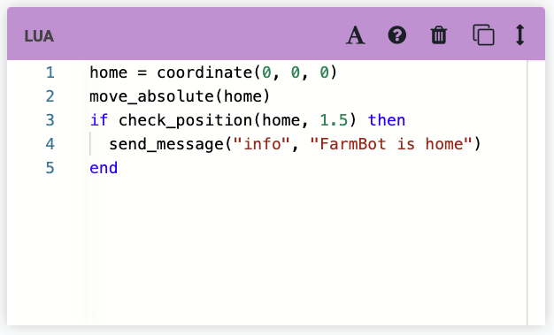
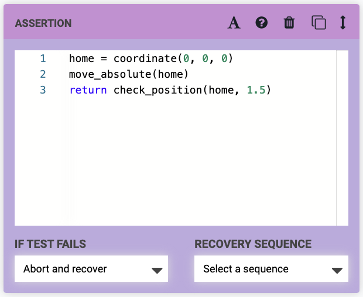
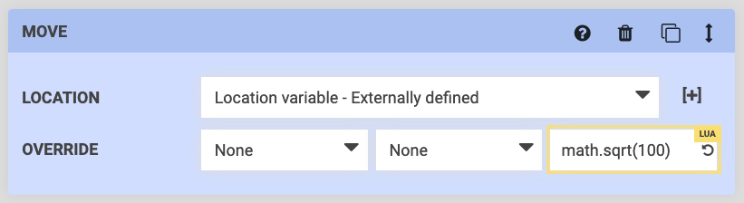

* toc
{:toc}

The [sequence editor](https://software.farm.bot/docs/sequences) is an easy to use tool for automating FarmBot operations. However, advanced users who are familiar with computer programming concepts may opt for a more advanced interface. For these users, we provide several methods to insert **Lua code fragments** directly into sequences:

# Lua commands

Using a Lua command is the most straightforward and universal way to use Lua in your sequences. With the Lua command, you can execute up to 3000 characters worth of code - enough to operate FarmBot's motors, sensors, peripherals, and camera, and even use 3rd party APIs.

# Assertion commands

The Assertion command also allows for long-form Lua code execution as well as the ability to execute a subsequence or abort execution depending on the `return`. ([Learn more](https://software.farm.bot/docs/advanced-sequence-commands)).

# Formulas

You can also execute Lua by using the **formula** option in a Move command's **OVERRIDE** or **X, Y, Z** input fields. This option is generally best for short-form code that only deals with positioning.

# What's next?

 * [Lua Functions](functions.md)
 * [Lua Examples](examples.md)
