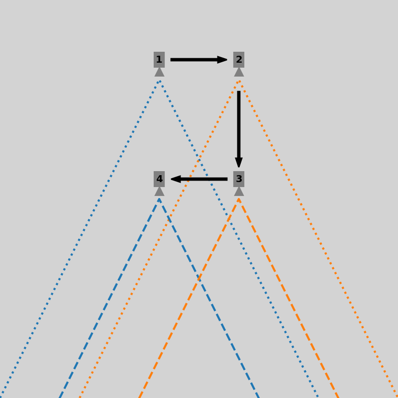
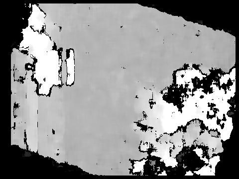
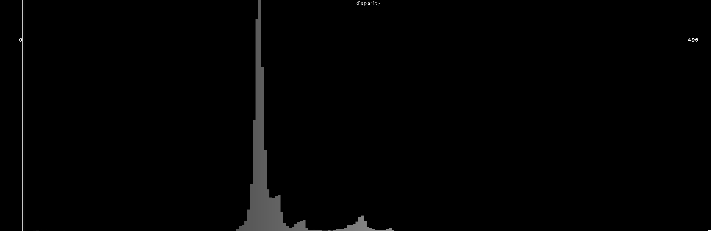

# Concept

Simulate a virtual stereo camera using FarmBot's CNC camera positioning system.

Stereo photography, like binocular vision, provides depth information
via parallax, where subjects closer to the lens move further in the frame
between lens positions than subjects farther from the lens. OpenCV computes
this disparity between detected object positions in stereo image frames.

This process is performed at multiple locations to develop equation
coefficients for a correlation between disparity and distance for a particular
camera and environment. These coefficients are applied to the computed disparity
values (with the soil as the subject) to calculate distance, which is finally
combined with camera position data from FarmBot's known coordinate system
to calculate the z axis coordinate of the soil.

With the soil position mapped to FarmBot's coordinate system, FarmBot can
perform actions that engage the soil surface such as seeding and weeding.

# Alternatives
 * Manually measure the distance from the FarmBot's UTM to the soil and
 subtract it from the current z-axis position.
 * Move FarmBot to the soil surface using manual controls and record the
 z-axis position.
 * Add a button to FarmBot's UTM that triggers when it collides with the
 soil surface.
 * Use an ultrasonic, infrared, or LiDAR distance sensor.
 * Use a stereo camera.

# Capture images
Move to locations a short distance apart to simulate a stereo camera.


For calibration, move to multiple z-axis locations and capture stereo pairs
at each.



# Prepare images
Adjust the captured images as necessary to create an aligned stereo image pair.


Detect camera rotation using optical flow:


For the stereo depth calculation to work correctly, features in the left input
image must trace a horizontal path to the right input image.


# Compute depth map
Combine stereo images to generate a disparity/depth map.




Histogram illustrating occurrence frequency of values in depth map:



# Determine location of soil in image
Assume the most common depth map value represents the soil.
In the following image, the selected soil depth is highlighted in green.
Depth values for objects far from the soil level are highlighted with red,
with bright red indicating objects closer to the camera and dark red
indicating objects farther from the camera.


Annotate the depth map using the same color-coding:


Exclude plants using HSV filtering with the values provided in the
`Weed detector` section of the _Photos_ panel.

Plants selected:


Plants removed from depth map to not interfere with soil surface selection:


# Calibrate disparity vs distance conversion factors


Two coefficients are necessary to calculate distance from the raw disparity
data. The following are used:
 * a disparity multiplication factor (`calibration_factor`)
 * a disparity offset constant (`disparity_offset`)

Example calculations, where:
 * Soil was measured 250mm from camera when camera was at z = 0
 * Soil disparity was calculated from a stereo image pair (`disparity_offset`)
 at z = 0
  * Soil disparity was calculated from a stereo image pair (`disparity_value`)
 at z = -50

```
disparity_delta = disparity_value - disparity_offset
64              = 176             - 112

z_offset = measured_at_z - current_z
50       = 0             - (-50)

calibration_factor = z_offset / disparity_delta
0.7812             = 50       / 64
```

See [calculate distance and soil z](#calculate-distance-and-soil-z) for z
calculations.

# Calculate distance and soil z

Example calculations, where:
 * Soil was measured 250mm from camera when camera was at z = 0
 * Calibration values were previously calculated (`calibration_factor`
 and `disparity_offset`)
 * Soil disparity was calculated from a stereo image pair (`disparity_value`)
 at z = -50

```
measured_soil_z = measured_at_z - measured_distance
-250            = 0             - 250

disparity_delta = disparity_value - disparity_offset
64              = 176             - 112

distance_offset = disparity_delta * calibration_factor
50              = 64              * 0.7812

distance = measured_distance - distance_offset
200      = 250               - 50

calculated_soil_z = current_z  - distance
-250              = -50        - 200
```
