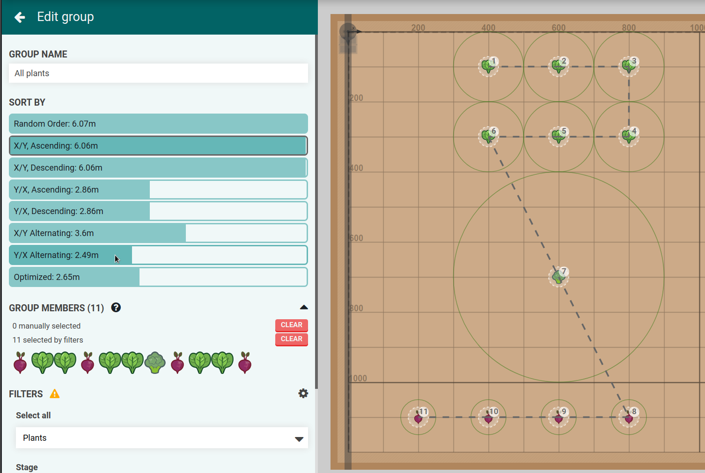

# Setup
```javascript
// Example data
var points = [
  { uuid: "1", body: { x: 1, y: 1 } },
  { uuid: "2", body: { x: 2, y: 2 } },
  { uuid: "3", body: { x: 0, y: 10 } },
  { uuid: "4", body: { x: 10, y: 0 } },
  { uuid: "5", body: { x: 10, y: 10 } },
];

// Library
var script = document.createElement('script');
script.type = 'text/javascript';
script.src = 'https://cdn.jsdelivr.net/npm/lodash@4/lodash.min.js';
document.head.appendChild(script);
```

# Random
```javascript
_.shuffle(points)

// sample example data order: 4 1 2 3 5
```

# X/Y Ascending
```javascript
_.sortBy(points, ["body.x", "body.y"])

// expected example data order: 3 1 2 4 5
```

# X/Y Descending
```javascript
_.sortBy(points, ["body.x", "body.y"]).reverse()

// expected example data order: 5 4 2 1 3
```

# Y/X Ascending
```javascript
_.sortBy(points, ["body.y", "body.x"])

// expected example data order: 4 1 2 3 5
```

# Y/X Descending
```javascript
_.sortBy(points, ["body.y", "body.x"]).reverse()

// expected example data order: 5 3 2 1 4
```

# X/Y Alternating

```javascript
_.chain(points)
  .map(p => p.body.x)
  .uniq()
  .sortBy()
  .map((x, index) =>
    index % 2 == 0
      ? _.sortBy(points.filter(p => p.body.x == x), "body.y")
      : _.sortBy(points.filter(p => p.body.x == x), "body.y").reverse())
  .flatten()
  .value()

// expected example data order: 3 1 2 5 4
```

# Y/X Alternating

```javascript
_.chain(points)
  .map(p => p.body.y)
  .uniq()
  .sortBy()
  .map((y, index) =>
    index % 2 == 0
      ? _.sortBy(points.filter(p => p.body.y == y), "body.x")
      : _.sortBy(points.filter(p => p.body.y == y), "body.x").reverse())
  .flatten()
  .value()

// expected example data order: 4 1 2 5 3
```

# Optimized

Nearest neighbor algorithm:

```javascript
var ordered = [];
let available = points.filter(p => p);
let from = { x: 0, y: 0 };
points.map(() => {
  const nearest = _.sortBy(available.map(p => ({
    point: p,
    distance: Math.pow(Math.pow(p.body.x - from.x, 2)
                     + Math.pow(p.body.y - from.y, 2), 0.5)
  })), "distance")[0].point;
  ordered.push(nearest);
  from = { x: nearest.body.x, y: nearest.body.y };
  available = available.filter(p => p.uuid !== nearest.uuid);
});

// expected example data order: 1 2 3 5 4
```
