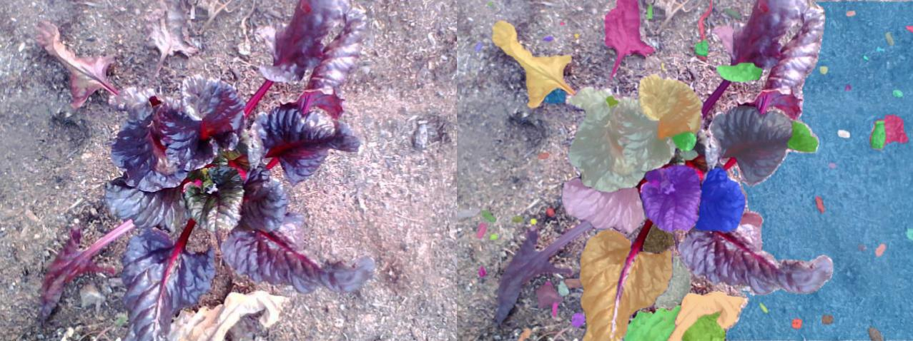
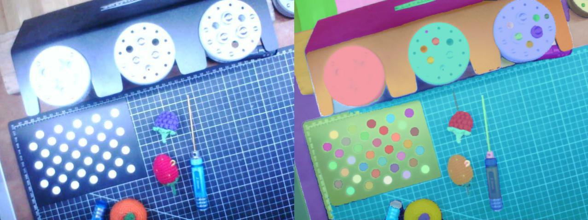

This script demonstrates how to use the **Segment Anything Model** (SAM) to segment images taken by a FarmBot. An image URL can be obtained either from the API or by listening to the message broker.





# Code



```python
import json
import time
import math
import requests
import numpy as np
from PIL import Image
from io import BytesIO
import matplotlib.pyplot as plt
from farmbot import Farmbot
from segment_anything import SamPredictor, SamAutomaticMaskGenerator, sam_model_registry

# Add the SAM model you've downloaded to the current directory and list its path and type here.
# The vit_l model (1.25GB) used in this example provides a good balance between speed and results.
# It will take 20 to 100 seconds using a CPU to segment a 640 x 480 image with the vit_l model.
# Using a machine with a CUDA-enabled GPU will be much faster.
model_checkpoint = "sam_vit_l_0b3195.pth"
model_type = "vit_l"

# Set image_url_source to "api" to get the URL of the last uploaded image from the FarmBot API.
# Set image_url_source to "broker" to listen to the message broker for the URL of the next image uploaded.
image_url_source = "api"

# Initialize the FarmBot class
bot = Farmbot()
token = bot.get_token("user@email.com", "password")
bot.set_verbosity(0)

# Get the URL of the last uploaded image from the FarmBot API
if image_url_source == "api":
    print("Getting the URL of the last uploaded image from the FarmBot API...")
    images = bot.api_get("images")
    image_urls = [image["attachment_url"] for image in images]

    if bot.state.verbosity > 0:
        print(json.dumps(image_urls, indent=2))

    if len(image_urls) == 0:
        print("No images found")
        exit(1)

    print(len(image_urls), "images found")

    url = image_urls[0]

# Listen to the message broker for the URL of the next image uploaded
elif image_url_source == "broker":
    print("Listening to the message broker for the URL of the next image uploaded...")
    bot.listen(
        duration=math.inf,
        message_options={
            'filters': {
                'topic': 'sync/Image',
                'content': {'body.attachment_url': 'storage'},
            },
            'path': 'body.attachment_url',
        }
    )
    url = bot.state.last_messages['sync_excerpt'][-1]

# Download the image
first_image = requests.get(url)

if first_image.status_code == 200:
    print("Downloaded image from URL:", url)
else:
    print("Failed to download image from URL:", url)
    exit(1)

img = Image.open(BytesIO(first_image.content))
img_np = np.array(img)

# Load the Segment Anything Model (SAM)
sam = sam_model_registry[model_type](checkpoint=model_checkpoint)
predictor = SamPredictor(sam)

# Run segmentation
start_time = time.time()
print("Segmenting image... this may take a few minutes depending on the model and your computer's hardware.")
mask_generator = SamAutomaticMaskGenerator(sam)
masks = mask_generator.generate(img_np)
print("Segmentation completed in {:.1f} seconds".format(time.time() - start_time))
print("Number of masks:", len(masks))

# Function to colorize and show the segmentation masks
def show_masks(masks):
    if len(masks) == 0:
        return
    sorted_masks = sorted(masks, key=(lambda x: x['area']), reverse=True)
    ax = plt.gca()
    ax.set_autoscale_on(False)

    img = np.ones((sorted_masks[0]['segmentation'].shape[0], sorted_masks[0]['segmentation'].shape[1], 4))
    img[:,:,3] = 0
    for mask in sorted_masks:
        segmentation = mask['segmentation']
        color_mask = np.concatenate([np.random.random(3), [0.6]])
        img[segmentation] = color_mask
    ax.imshow(img)

# Plot the image and all the segmentation masks
plt.figure(figsize=(10, 10))
plt.imshow(img)
show_masks(masks)
plt.axis('off')
plt.show()
```
