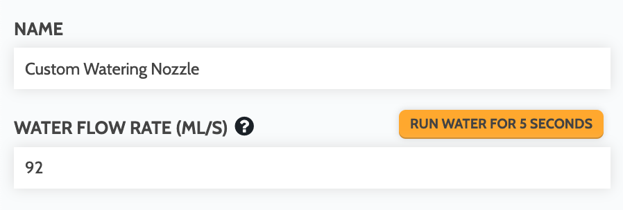

# dismount_tool()

**Dismounts the currently mounted tool** into it's assigned slot, taking into account the slot's direction.



```python
# Dismount the currently mounted tool
fb.dismount_tool()

# It is recommended to find home after dismounting tools
# to stage FarmBot for future operations
fb.find_home()
```

# mount_tool(tool_name)

**Mounts the given tool** and pulls it out of its slot, taking into account the slot's direction.



```python
# It is recommended to find home before mounting tools
# to ensure accuracy of movements
fb.find_home()

# Because tools themselves do not have coordinates, FarmBot
# will look up which slot the chosen tool has been assigned
# to and use the slot's coordinates in the mount_tool() function
fb.mount_tool("Seeder")
```

# dispense(milliliters, tool_name=None, pin=None)

**Dispenses the given amount of liquid in milliliters**. Defaults to using the "Watering Nozzle" tool, its **WATER FLOW RATE (ML/S)** value, and the solenoid valve operated by pin `8`.

```python
# Dispense 100 mL of water using default values
fb.dispense(100)
```

The `tool_name` and `pin` arguments are optional and can be used to override the default `tool_name` (and therefore the **WATER FLOW RATE (ML/S)** value) as well as which `pin` to operate.

```python
# Dispense 200 mL of fertilizer using a custom tool operated by pin 7
fb.dispense(200, tool_name="Custom Watering Nozzle 2", pin=7)
```

```python
# Dispense 300 mL of water with the standard "Watering Nozzle" tool, but using a solenoid valve operated by pin 10
fb.dispense(300, pin=10)
```



# water(plant_id, tool_name=None, pin=None)

**Moves to and waters the given plant** based on its age and assigned watering curve.







```python
# Water the plant based on its age and watering curve
fb.water(plant_id=123)
```

Under the hood, the `water()` function makes a call to `dispense()`. If provided, the `tool_name` and `pin` arguments will be passed into the `dispense` call to override its default values. See the [dispense() docs](#dispensemilliliters-tool_namenone-pinnone) for more information.

```python
# Water the plant based on its age and watering curve, using a solenoid valve operated by pin 10
fb.water(plant_id=123, pin=10)
```

# What's next?

 * [Time](./time.md)
