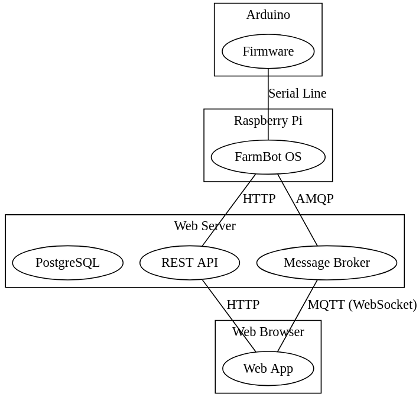

# Hardware and physical peripherals

Farmbot interacts with its environment using physical sensors and actuators. This requires a bridge between the physical garden and the software layer.

The [firmware](../firmware.md) is the software responsible for interaction with the real world. An Arduino based microcontroller runs the firmware and executes sensor and actuator commands. An example of this is seen when a FarmBot turns on the water valve or probes for soil moisture.

The [firmware](../firmware.md) package has a limited feature scope by design. It is a highly specialized software component. **It was not designed for developer extensibility.** Farmbot's microcontroller offers exceptional peripheral handling, but suffers from performance drawbacks. It is also a poor host for any task requiring more than a few kilobytes of memory.

For these reasons, **third party customization is best handled within [FarmBot OS](../farmbot-os.md) or the [Web App](../web-app.md)** (discussed below).

# Day to day operations and garden management

An Arduino lacks memory and processing power for non-hardware tasks. To combat these limitations, Farmbot also contains a [Raspberry Pi single board computer](https://www.raspberrypi.org). The Raspberry Pi provides increased memory, CPU and network peripherals. [FarmBot OS](../farmbot-os.md) is an embedded operating system which runs on the Raspberry Pi to manage tasks such as:

 * Communicating messages, such as reports or sensor data, to end users and the [REST API](../web-app/rest-api.md).
 * Enforcing device-level security features.
 * Maintaining and executing a work schedule.
 * Accept incoming remote procedure calls from users and off-device software packages.

FarmBot OS is particularly useful for operations that:

 * Need constant execution, even under network loss.
 * Have low or no network latency tolerance.

# Data storage and the cloud

The Raspberry Pi provides adequate processing power for many tasks. Much like the Arduino, it too suffers some design tradeoffs. The most notable issue is data integrity. Without regular backups, the device may lose data. This is also possible due to physical damage. Re-flashing would become tedious as well, due to personal setting loss between flashes. Additionally, some types of email alerts must occur even in offline situations.

An off-site and (always) online web application mitigates many of the issues noted. The Web App contains three core components in  one package:

 * A realtime message broker for messaging between the database, user, and device
 * A graphical user interface for end-user device control
 * A REST API for data storage and access

The documentation provides a detailed subsection for each of the components listed above.

# Common component use cases

|Task                          |Usually handled by...         |
|------------------------------|------------------------------|
|Long-Term Data Storage        |[REST API](../web-app/rest-api.md)
|Remotely managing device when device is offline|[Web App](../web-app.md) and [REST API](../web-app/rest-api.md)
|Managing device and account data.|[Web App](../web-app.md) and [REST API](../web-app/rest-api.md)
|Powering actuators            |[Firmware](../firmware.md)
|User-defined plugins          |[FarmBot OS](../farmbot-os.md) ([Farmware](../farmware.md))
|Recurring tasks               |[FarmBot OS](../farmbot-os.md)
|Long-running operations, such as watering sequences|[FarmBot OS](../farmbot-os.md)

