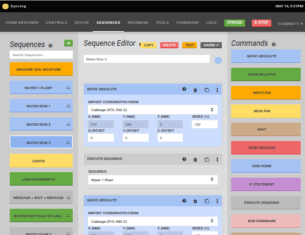

* toc
{:toc}

_The FarmBot Web App user interface_

_This document is intended for software developers. For end-user documentation, please see the [Web App User Documentation](https://software.farm.bot/docs/the-farmbot-web-app)_

# The User Interface

The FarmBot graphical user interface is a [single page application](https://en.wikipedia.org/wiki/Single-page_application) that allows users to control a FarmBot remotely. It supports editing of [Sequences](https://software.farm.bot/docs/sequences), [Regimens](https://software.farm.bot/docs/regimens) and [Farm Events](https://software.farm.bot/docs/farm-events).

# At a Glance

 * **Programming Language:** [TypeScript](https://www.typescriptlang.org/index.html)
 * **UI Library:** [ReactJS](https://reactjs.org)
 * **Build System:** [Parcel](https://github.com/parcel-bundler/parcel)
 * **State Management:** [Redux JS](https://redux.js.org)

# Useful Developer Utilities

 * `window.store.getState()` Get the current Redux store state from the browser's Javascript console.
 * `window.current_bot` The current FarmBot instance created by [FarmBot JS](../farmbot-js.md) from the browser's Javascript console.
 * `sudo docker-compose run web npm run typecheck` Runs the TypeScript type checker against the codebase in your terminal. Pull requests can not be accepted unless this step passes.
 * `sudo docker-compose run web npm run test` Runs [unit tests](https://en.wikipedia.org/wiki/Unit_testing) to prevent [regressions](https://en.wikipedia.org/wiki/Software_regression). This check must pass for a pull request to be accepted.

# Frequently Asked Questions

## How Do I Update or Add Translations?

Thanks for your interest in internationalizing the FarmBot web app! To add translations:

1. Fork this repo
2. Navigate to `/public/app-resources/languages` and run the command `node _helper.js yy` where `yy` is your language's [language code](http://www.science.co.il/Language/Locale-codes.php). Eg: `ru` for Russian.
3. Edit the translations in the file created in the previous step: `"phrase": "translated phrase"`.
4. When you have updated or added new translations, commit/push your changes and submit a pull request.

## My Code is Generating a "Content Security Warning"

The Web App implements a [content security policy](https://en.wikipedia.org/wiki/Content_Security_Policy) to prevent certain types of security violations, such as cross-site scripting and token theft. Unfortunately, this means that some code may not execute as intended. Please [raise an issue](https://github.com/FarmBot/Farmbot-Web-App/issues/new) if you have any questions.

## How Can I Add A Custom Page?

The user interface is not a [content management system](https://en.wikipedia.org/wiki/Content_management_system). Custom pages require modification to the application source code, which is not recommended. It is better to host custom forms and reports on a dedicated server and use the [REST API](rest-api.md) for inter-server communication.
