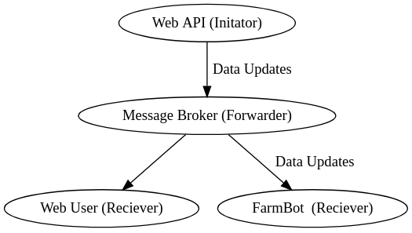

* toc
{:toc}

The FarmBot API provides an HTTP based [REST API](/v8/Documentation/web-app/rest-api.md). HTTP follows a response-request format, which is great when you are explicitly looking for data. However, some interactions do not lend themselves well to a request/response pattern. For example, if FarmBot must perform an emergency stop, we do not want to constantly check the API for such a message. Instead, we wish to receive such messages as soon as they are created and without explicitly asking. Other use cases include remote procedure calls and real-time data syncing.

The **message broker** is a sub-component of the web API which provides another method of communication which satisfies this requirement. It is a specially configured instance of [RabbitMQ](https://www.rabbitmq.com) that serves the following functions:

 * Passes push notifications between users and devices (discussed below).
 * Passes background messages between server background workers.
 * Uses a set of custom authorization plugins (to prevent unauthorized use).

The broker accepts messages over a variety of channels, such as [AMQP](https://www.amqp.org), [MQTT](http://mqtt.org) and [WebSockets](https://developer.mozilla.org/en-US/docs/Web/API/WebSockets_API) (discussed later in this document).

## Example: Real-time FarmBot control

One place where HTTP fails to be an adequate solution is remote procedure calls. If FarmBot _only_ used HTTP as a communication mechanism, a device would be forced to perform long polling and constantly make HTTP requests to the API for any new remote procedure calls. Polling would create tremendous scalability issues for the web app and provide a sub-par real-time experience for users.

With a real-time message broker, there is no need to check for new messages. Messages (such as a user clicking the "move" button on the [user interface](/v8/Documentation/web-app/user-interface.md)) can be sent back and forth between client, device and server without initiating a request.

**In many ways, the message broker acts as a machine-to-machine chat application.** Any software package, whether it be the [REST API](/v8/Documentation/web-app/rest-api.md), [FarmBot OS](/v8/Documentation/farmbot-os.md) or a third-party [Farmware](/v8/Documentation/farmware.md) can send a message to any other entity that is currently connected to the message broker, with correct authorization of course.


_Example: Sending a Remote Procedure Call_

## Example: Data Sync

When a user enables auto-sync on their device, the Web API will constantly upload data changes to the bot in real-time and without user intervention. This means that the user no longer needs to push the "sync" button after making changes in the [User Interface](/v8/Documentation/web-app/user-interface.md).

As mentioned previously, the Web API cannot send outbound messages via HTTP, since the protocol only supports request/response communication. In the case of data updates, FarmBot does not know that data on the API has changed and as such, does not make a request to download the data.

The workaround for this problem is to _allow the Web API to send outbound messages via the message broker_. These messages are initiated in a background process on the Web API. The messages are sent over the message broker rather than HTTP. In this case, the Web API acts both as a web _server_ and a message broker _client_.



_Example: Auto-Sync Updates_

# Message broker device login
A device or user may log in to the message broker using a username and password:

 * **Username:** Use the `"bot"` claim* of your [authorization token](https://developer.farm.bot/v6/docs/rest-api#section-how-do-i-generate-an-api-token-) as a username
 * **Password:** Use the `encoded` authorization token as a password. It is a very long string that contains two `.` characters in it. It is contained in the `encoded` property of your auth token.

**The specific login process will vary based on the communication channel used (see below).**

\*This [JWT claim](https://scotch.io/tutorials/the-anatomy-of-a-json-web-token) follows the format of `"device_<id>"` where `<id>` is the numeric ID of your FarmBot. After generating the authorization token, it will be visible on the `unencoded.bot` property of the token.

# Communication channels
As mentioned previously, the message broker is an instance of [RabbitMQ](https://www.rabbitmq.com). RabbitMQ supports multiple communication channels such as [AMQP](https://www.rabbitmq.com/tutorials/amqp-concepts.html), [WebSockets](https://www.rabbitmq.com/web-mqtt.html) and [MQTT](https://www.rabbitmq.com/mqtt.html).

## WebSockets
If you are attempting to connect to the message broker from a web browser, you will need to connect via **WebSockets**. This is a popular approach for developers that are:

 * Building custom user interfaces.
 * Building custom device control software.
 * Remotely debugging device issues in a browser.

The best way to connect to the broker via WebSockets is with [FarmBot JS](/v8/Documentation/farmbot-js.md) (easy). Some advanced users may prefer to directly connect via [MQTT.js](https://github.com/mqttjs/MQTT.js), though this is not appropriate for any use case other than debugging.

## MQTT
If your application does not run in a browser, **MQTT** is the preferred connection mechanism. Examples:

 * Building a desktop application to control FarmBot
 * Building a server that provides supplemental features to the Web API

The client used depends heavily on the language of your application and personal preference. A list of MQTT client libraries is [available here](https://github.com/mqtt/mqtt.github.io/wiki/libraries). Please see the specific library documentation for specific instructions.

## AMQP
A third connection channel is **AMQP**. This is the channel used by [FarmBot OS](/v8/Documentation/farmbot-os.md). We do not recommend the use of AMQP and reserve the right to make breaking changes to AMQP usage without notice. You should only use AMQP if you are directly modifying the FarmBot OS source code.

# Sending commands
FarmBotJS wraps common MQTT and [CeleryScript](https://github.com/FarmBot/farmbot-js/wiki/Celery-Script) operations into a single module. This allows you to focus on controlling FarmBot without needing to understand the underlying protocols of the system.

Not every project is written in Javascript, however, and users occasionally wish to write their own wrapper libraries in a language of choice (Python, Ruby, Java etc...)

## Step 1: Understand the protocols

FarmBot uses MQTT for realtime data such as sending commands and getting live status updates. Before writing FarmBot control software, **knowledge of MQTT is required**.

We recommend HiveMQ's excellent ["MQTT Essentials" tutorial](http://www.hivemq.com/mqtt-essentials/) for developers who are new to MQTT.

## Step 2: Find required information

Before sending commands, you need the following information:

1. An API token
2. The device's ID (see `"bot"` claim of the API token)
3. The MQTT server host name (See `"mqtt"` claim of API token).

All of this information is provided by the API when you create an API token. Instructions for generating a token can be found [here](https://developer.farm.bot/docs/rest-api#section-how-do-i-generate-an-api-token-).

Here is an example token:


```json

  "token": {
    "unencoded": {
      ... EXTRA INFORMATION REMOVED FOR CLARITY ...
      "mqtt": "clever-octopus.rmq.cloudamqp.com",
      "bot": "device_36"
    },
    "encoded": "eyJ0eXAiOiJK.eyJzdWIiOiJlbGl.6YWJldGhAaGFu"
 ... EXTRA INFORMATION REMOVED FOR CLARITY ...
}
```

In the token above, we can see the following:

 * The device ID is `device_36`. **This is your MQTT server username. You will also need to use this later.**
 * The API token is `eyJ0eX....NGE0`. **Use this as a password when loging into MQTT.**
 * The MQTT host is found in the `mqtt` property of your token. In this case, the MQTT server host is `clever-octopus.rmq.cloudamqp.com`. Your `mqtt` value may be different and host values *may change without notice*. Always grab this value from the token. **Never hard-code the `mqtt` host directly into application code**- it may change in the future without notice.

## Step 3: Subscribing to topics




Now that you have all the required information we can subscribe to topics (listed below). In all these examples, you can replace `DEVICE_ID_HERE` with your actual device ID. In the example above, the device ID would be entered as `device_36`.

 * **bot/DEVICE_ID_HERE/from_clients**: This channel will receive inbound [RPC](https://en.wikipedia.org/wiki/Remote_procedure_call) requests that the device must process.
 * **bot/DEVICE_ID_HERE/from_device**: Responses to inbound RPC requests will be sent back to clients from this channel.
 * **bot/DEVICE_ID_HERE/status**: The bot's "state tree" is constantly updated on this channel. This will include information such as the X/Y/Z coordinates and the bot's sync status.
 * **bot/DEVICE_ID_HERE/logs**: Logs intended to be read by humans are sent here. This is identical to the "ticker" seen in the web app.

## Step 4: Publishing commands



As mentioned above, commands are sent to the device via the `/from_clients` channel. These commands must be formatted as valid [CeleryScript](/v8/Documentation/celery-script.md). Conversely, responses from the device are viewable in the `/from_device` channel.

Subscribing to the `/status` channel allows developers to get a real-time view of the entire FarmBot OS state tree.
